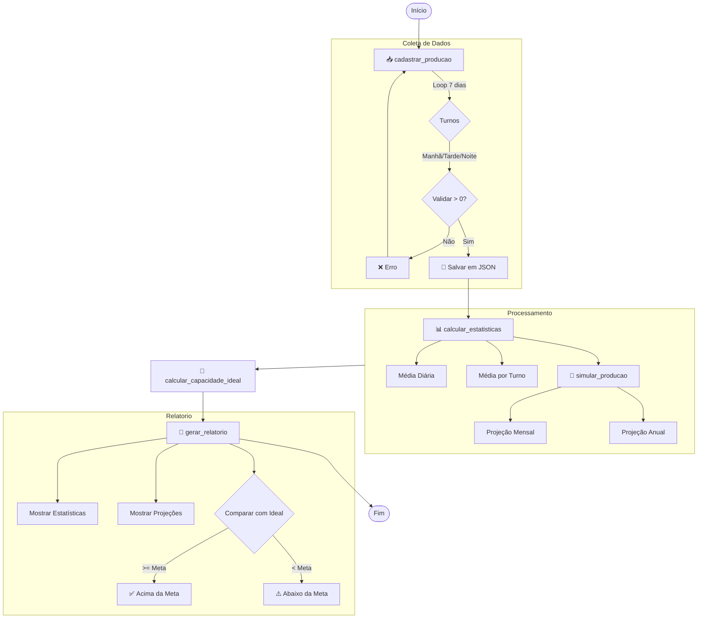

# ⚙️ Fluxograma do Módulo Operacional

Este documento descreve o fluxo de funcionamento do módulo Operacional (`modules/operacional.py`), responsável pelo controle de produção e relatórios executivos.

## 🔄 Visão Geral do Processo

O módulo segue um fluxo linear de coleta de dados, processamento estatístico e geração de relatórios comparativos.

## 📝 Descrição das Etapas

1. **Cadastrar Produção (`cadastrar_producao`)**:
   - Coleta dados de 7 dias da semana.
   - Para cada dia, coleta produção de 3 turnos (Manhã, Tarde, Noite).
   - Valida entradas negativas.
   - Persiste dados em arquivo JSON.

2. **Calcular Estatísticas (`calcular_estatisticas`)**:
   - Consolida total semanal.
   - Calcula média diária.
   - Calcula média específica por turno.

3. **Simular Produção (`simular_producao`)**:
   - Projeta produção mensal (x4 semanas).
   - Projeta produção anual (x52 semanas).

4. **Calcular Capacidade Ideal (`calcular_capacidade_ideal`)**:
   - Define meta baseada em 3 turnos.
   - Meta: 750 unidades/mês (187.5/semana).

5. **Gerar Relatório (`gerar_relatorio`)**:
   - Exibe todos os dados calculados de forma formatada.
   - Compara realizado vs ideal.
   - Indica status visual (✅ ou ⚠️).
